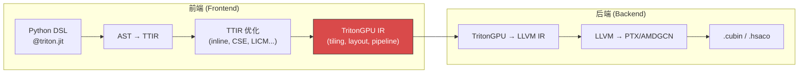

# triton-anchor v0.1

> **项目定位**：面向多款芯片的共性编译前端，在统一的 Triton 编译前端中同时支持 **RISC-V Matrix 扩展指令集**（**AME）**、**RISC-V Tensor 扩展指令集**和 **SIMT 扩展指令集（GPGPU）** 的插件化架构。

## 1. "前端"的边界定义

### 1.1 以 TritonGPU IR 为参照

在 OpenAI 标准 Triton 中，**TritonGPU IR 是前后端的分界线**：



*   **向上（前端职责）**：tiling 决策、数据布局分配、内存层次映射、流水线 stage 划分
    
*   **向下（后端职责）**：硬件指令选择、寄存器分配、二进制生成
    

### 1.2 非 GPU 后端的等价层次

对于 Linalg 路径后端，**Linalg + Extensions IR** 扮演与 TritonGPU IR 完全等价的角色：

| 维度 | TritonGPU IR (GPU) | Linalg + Extensions (非 GPU) |
| --- | --- | --- |
| **Tiling** | block/warp/thread 分解 | `smt.parallel`, LinalgExt tiling |
| **布局** | `#blocked`, `#shared`, `#mma` | `memref` 布局, `xsmt.ViewOp` |
| **内存层次** | shared memory allocation | `smt.alloc(storage="l2")` |
| **计算原语** | `tt.dot` → MMA | `smt.dot` (MMT4D), `linalg.matmul` |
| **同步** | `__syncthreads()` | `smt.mbarrier` / `xsmt_async.*` |

### 1.3 统一定义

> \[!IMPORTANT\] **编译前端 = 全栈编译工具链中，负责将 Triton DSL 转换为"硬件感知中间表示"的编译器部分。**

*   **输入**：`@triton.jit` Python 函数
    
*   **输出**：硬件感知但非硬件特定的 IR（TritonGPU IR 或 Linalg+Extensions IR）
    
*   **职责**：DSL 解析、TTIR 生成/优化、指针分析、Tiling 决策、计算原语匹配
    
*   **不包含**：目标硬件指令选择（待确认）、寄存器分配、二进制生成
    

## 2 架构设计

triton-anchor 将编译流程前端化，分离了与具体硬件无关的公共优化与转换逻辑，整体架构分为三个核心层级：

```
Layer 1    — TTIR Pipeline        (7 mandatory passes)
Layer 2    — Linalg Adapters      (ILinalgOptAdapter / ILinalgPybindAdapter)
Layer 2.5  — AnchorIR Spec        (dual-track whitelist + two-phase validation)
```

### 2.1 核心设计特性

- **双轨 AnchorIR**：为不同的计算硬件提供两条标准路径——Linalg Track（面向 Tensor Processor 与 AME Matrix）与 TritonGPU Track（面向 gpGPU），每条路径拥有独立的 Op 白名单。
- **两阶段验证**：AnchorIR 的合法性会经历 `validate_pre_hook()` → Hook 注入 → `validate_post_hook()` 两阶段检查，确保底层硬件后端注入的扩展 Op 也严格受契约约束。
- **ABI 隔离**：提供 `ILinalgOptAdapter`（基于子进程调用 `opt` 的模式）与 `ILinalgPybindAdapter`（基于 Pybind 绑定的模式），在类型层面隔离 C++ ABI，避免多后端带来的符号冲突。
- **Paradigm / Track 解耦**：`ComputeParadigm`（计算范式）与 `AnchorIRTrack`（IR 轨道）独立声明，硬件后端可根据自身特性自由组合。

## 3 安装与开发

> 💡 **详细指南**：关于如何从零配置 Docker 环境、安装系统依赖及完整的构建流程，请参阅 [构建与环境配置指南](docs/build.md)。

推荐使用 [uv](https://github.com/astral-sh/uv) 进行极速环境搭建和基础依赖安装：

```bash
# 开发模式安装 triton-anchor
uv pip install [--no-build-isolation] -e .

# 构建可分发的 wheel 包
uv build --wheel [--no-build-isolation]
```

## 4 目录结构

```
triton-anchor/
├── triton/                  # 上游 Triton 核心（C++ 基础设施与原版 Python 前端）
├── csrc/                    # triton-anchor 扩展的 C++ Passes (例如 triton-linalg)
├── docs/                    # 文档（构建与环境配置指南等）
├── tests/                   # 框架及端到端测试
└── python/
    └── triton_anchor/       # triton-anchor 纯前端逻辑层
        ├── __init__.py      # 公共 API: HWCapability, ComputeParadigm, AnchorIRTrack
        ├── hw_capability.py # HWCapability 属性与结构设计
        ├── anchor_ir.py     # AnchorIR 双轨规范白名单 + 两阶段验证器
        ├── pipeline.py      # 统一 TTIR Pipeline (7 pass)
        │
        ├── adapters/        # Layer 2: Linalg Adapters
        │   ├── base.py              # ILinalgOptAdapter / ILinalgPybindAdapter
        │   ├── registry.py          # Adapter 注册表
        │   └── triton_linalg_adapter.py  # ✅ triton-linalg pass 管线 (Pybind)
        │
        └── extensions/      # DSL Extensions（层级预留）
```

## 5 编译流程

triton-anchor 负责统一管线的前半部分（TTIR → Linalg / TritonGPU），后半部分（Linalg → 硬件二进制）由各硬件后端独立完成。

```
AST → TTIR
  │
  ├── Layer 1: build_ttir_pipeline (7 pass)
  │     ├── inliner → combine → canonicalizer → reorder_broadcast → cse → licm → symbol_dce
  │     └── [GPU] _require_pass(add_rewrite_tensor_pointer)
  │
  ├── Layer 2: Adapter.convert()
  │     ├── Linalg Track: TritonLinalgAdapter (pybind) / TritonSharedAdapter (subprocess)
  │     └── TritonGPU Track: 直通后端
  │
  ├── Layer 2.5: AnchorIR 验证
  │     ├── validate_pre_hook()  ← 基础白名单
  │     └── validate_post_hook() ← 基础 + 扩展白名单
  │
  └── 硬件后端 (out-of-tree)
        ├── Tensor Processor:   Linalg → 专用编译栈 → .so
        ├── AME Matrix:         Linalg → LLVM → .so
        └── gpGPU:              TritonGPU → SPIR-V → binary
```

## 6 硬件后端集成

硬件后端（如特定的 TPU 或 NPU）作为**独立的 out-of-tree 包**实现，不在 triton-anchor 内部维护。

### 6.1 自动发现与注册
各硬件后端通过 `pyproject.toml` 中的 `entry_points` 机制自动注册，在 `import triton` 时被 Triton 发现：

```toml
# 硬件后端包的 pyproject.toml
[project.entry-points."triton.backends"]
my_device = "triton_my_device"
```

后端包的 `__init__.py` 需要在模块级导出以下两个属性供 pull 模式使用：

```python
# triton_my_device/__init__.py
from .compiler import MyDeviceBackend
from .runtime import MyDeviceDriver

compiler_cls = MyDeviceBackend   # 继承 triton.backends.compiler.BaseBackend
driver_cls = MyDeviceDriver      # 继承 triton.backends.driver.DriverBase
```

### 6.2 计算范式参考

| 计算范式 | 包名示例 | 说明 |
|------|------|------|
| **Tensor Processor** | `triton-sophgo-backend` | 面向具备独立 Tensor Core/NPU 的专用加速器 |
| **AME Matrix** | `ongoing` | 面向带矩阵扩展指令集的 RISC-V 架构 |
| **gpGPU** | `ongoing` | 面向 SIMT 架构 GPU |


## 7 License

本项目基于 [Apache License 2.0](http://www.apache.org/licenses/LICENSE-2.0) 开源发布。详见 [LICENSE](LICENSE) 文件。

```
Copyright 2026 RISC-V AI算力生态（RACE）委员会 & 北京开源芯片研究院 （BOSC）
```

### 7.1 致谢与引用项目

triton-anchor 的开发离不开以下优秀的开源项目，本项目引用并受益于它们的工作成果：

| 项目 | 许可证 | 链接 |
|------|--------|------|
| **Triton** | MIT License | [https://github.com/triton-lang/triton](https://github.com/triton-lang/triton) |
| **triton-linalg** | Apache 2.0 | [https://github.com/Cambricon/triton-linalg](https://github.com/Cambricon/triton-linalg) |
| **triton-shared** | MIT License | [https://github.com/microsoft/triton-shared](https://github.com/microsoft/triton-shared) |

### 7.2 发布者

- **RISC-V AI算力生态（RACE）委员会**
- **北京开源芯片研究院（BOSC）**
