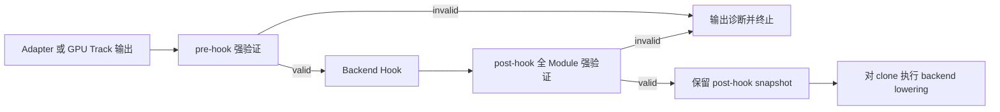

# AnchorIR 结构化强验证与 Golden 回归（Triton 3.6）

本文档说明 T6.5 在 `triton_v3.6` 分支中的实现、版本适配、对外接口和验收边界。它是开发者面向的实现与测试指南；AnchorIR 规则的唯一机读来源仍是 `python/triton_anchor/spec/anchor-ir-*.json`。

## 1. 目标与范围

T6.5 将 AnchorIR 从文本或顶层 Operation 名称检查提升为结构化、版本化且 fail-closed 的合同边界，并为关键编译阶段建立稳定的规范化和 Golden 比较语义。本分支实现覆盖：

- 有界遍历 `Operation`、`Region`、`Block`、`Type`、`Attribute` 和 Operation Properties，检查嵌套对象并生成稳定对象路径；
- 先执行结构、语义和 verifier 安全预检，只在安全且没有合同违规时调用 MLIR verifier；
- 按 `spec_version + track + phase` 解析不可变 policy，区分未知方言、显式 Forbidden 和跨对象语义不变量；
- 使 C++ 核心、Python API 和 CLI 共用 `AnchorIRValidationReport` 诊断模型；
- 统一 Adapter 输出、pre-hook、Backend Hook、post-hook 和 backend lowering 的 fail-closed 顺序；
- 对通过强验证的 IR 生成稳定规范化文本和 SHA-256，并在 Golden 回归中定位首个偏移 Stage；
- 提供 Linalg 和 TritonGPU 两条 Track 的正例、反例及关键阶段 Golden 样本。

## 2. Triton 3.6 实现与版本适配

| 层次 | 主要文件 | 职责 |
|---|---|---|
| 版本化规则 | `python/triton_anchor/spec/anchor-ir-1.0.0.json`<br>`anchor-ir-1.1.0.json`<br>`anchor-ir-2.0.0.json`<br>`anchor-ir-3.0.0.json` | 保留历史合同供审计，定义 Track 的 allowed/forbidden 方言、语义不变量和稳定诊断模板。 |
| 规则解析 | `python/triton_anchor/anchor_ir_rules.py` | 校验版本、Track、Phase 和扩展声明，将当前 JSON 解析为不可变 policy。 |
| 诊断模型 | `python/triton_anchor/anchor_ir_schema.py` | 定义错误码、Track/Phase、对象类型、Operation/Object 路径、Source Location 和修复提示。 |
| C++ 结构化核心 | `csrc/lib/Validation/AnchorIRValidator.cpp`<br>`csrc/include/triton-anchor/Validation/AnchorIRValidator.h` | 对真实 `mlir::ModuleOp` 执行有界遍历、Type/Attribute/Properties 递归检查、双 Track 语义规则、verifier 安全预检与规范化。 |
| 3.6 绑定与方言注册 | `csrc/bindings/triton_anchor_ext.cc`<br>`csrc/bindings/triton_anchor_validator.cc`<br>`csrc/CMakeLists.txt`<br>`triton/CMakeLists.txt` | 在同一 `TritonSharedPlugin` 中导出 `triton_shared` 和 `anchor` Python 模块，注册 Validator 及 Linalg/TritonGPU 合同所需方言。 |
| Python API 与生命周期 | `anchor_ir_validator.py`<br>`anchor_ir_lifecycle.py`<br>`pipeline.py`<br>`adapters/base.py` | 对 ModuleOp/文本返回统一报告，并在 Hook 前后强制全 Module 验证。 |
| 3.6 Linalg Adapter | `python/triton_anchor/adapters/triton_linalg_adapter.py` | 加载 Anchor/Linalg 方言，调用当前分支的 in-tree Triton-to-Linalg Pass；3.6 的 PassManager 使用 `pm.run(module, "anchor-linalg-adapter")` 稳定 reproducer tag。 |
| 规范化与 Golden | `anchor_ir_normalizer.py`<br>`anchor_ir_golden.py` | 生成稳定文本/SHA-256，记录 Stage manifest，报告首个偏移 Stage、新旧哈希和 IR diff。 |
| CLI | `python/triton_anchor/anchor_ir_cli.py` | 提供 `triton-anchor-validate`，支持 text/JSON 输出和稳定退出码。 |
| 样本与验收 | `python/triton_anchor/tests/data/anchor_ir/`<br>`python/triton_anchor/tests/test_anchor_ir_*.py`<br>`scripts/verify_t65*.py` | 覆盖双 Track 正反例、结构/语义诊断、资源限制、生命周期、CLI/API、规范化、Golden 和打包。 |

当前 Triton 3.6 构建只执行 `anchor-ir/3.0.0` 合同；`1.0.0`、`1.1.0` 和 `2.0.0` JSON 仅随包保留供版本审计，不会由当前 C++/MLIR 实现执行。`3.0.0` 的 Linalg Track 允许 15 个核心方言，TritonGPU Track 允许 9 个核心方言。C++ 不复制白名单，而是使用 Python 从 JSON 构造的 policy。

Triton 3.6 当前 IR 文本使用 `ttg` 作为 TritonGPU Dialect namespace，例如 `#ttg.blocked`、`!ttg.memdesc` 和 `ttg.num-warps`；Triton 操作仍使用 `tt`。历史合同中的 `triton_gpu` 是旧 namespace，不应当作 3.6 输出的当前拼写。

## 3. 强制生命周期与调用方式



pre-hook 只允许当前 Track 的核心规则；失败时 Hook 和 lowering 都不执行。post-hook 重新验证 Hook 修改后的整个 Module，只允许 Hook 通过 `get_allowed_dialects()` 声明的非核心扩展；核心 Forbidden 不能被扩展覆盖。ModuleOp lowering 接收已验证 Module 的 clone，不会改写报告中的 post-hook 边界快照。

Linalg Adapter 的生产接入应调用：

```python
report = adapter.compile(
    ttir_module,
    metadata,
    hook=backend_hook,
    backend_lowering=lower_to_binary,
    context=ttir_context,
)
binary = report.lowered_output
```

`adapter.compile()` 内部调用 `run_anchor_ir_compilation()`。TritonGPU Track 或不经 Linalg Adapter 的外部后端应调用 `AnchorIRLifecycleOrchestrator.run_module_or_raise()`。生产管线不应只调用低层 `adapter.convert()` 后直接 lowering。

`triton.compiler.compile()` 只执行后端登记的 stages，不会自动注入 AnchorIR 生命周期。out-of-tree 后端必须按 [自定义硬件后端指南](custom_backend.md) 把 fail-closed 入口放入自己的编译 stage，并将 `ANCHOR_IR_SPEC_VERSION`、规范化版本和 Hook 版本纳入后端 cache key。

`python/triton_anchor/anchor_ir.py` 中的 `AnchorIRValidator`（包括
`validate()`、`is_valid()`、`validate_and_raise()` 和
`validate_pre_hook()/validate_post_hook()`）只保留 legacy regex 兼容扫描。
它不解析 MLIR，不能检查嵌套 Region、Type、Attribute、Properties、verifier
或 Track 语义，因此不是 production AnchorIR gate；新接入应使用
`StructuredAnchorIRValidator` 或统一生命周期入口。

### Python API 和 CLI

```python
from triton_anchor import (
    ANCHOR_IR_SPEC_VERSION,
    AnchorIRPhase,
    AnchorIRTrack,
    StructuredAnchorIRValidator,
)

report = StructuredAnchorIRValidator().validate_text(
    mlir_text,
    spec_version=ANCHOR_IR_SPEC_VERSION,
    track=AnchorIRTrack.LINALG,
    phase=AnchorIRPhase.PRE_HOOK,
    source_name="input.mlir",
)
```

```bash
triton-anchor-validate input.mlir \
  --spec-version anchor-ir/3.0.0 \
  --track linalg \
  --phase pre_hook \
  --format json
```

CLI 对合法 IR 返回 `0`，对合同不合法 IR 返回 `1`，对用法或基础设施错误返回 `2`。JSON 输出与 Python API 的 `report.to_dict()` 使用同一序列化模型。

## 4. 规范化与 Golden

`AnchorIRNormalizer` 只为通过强验证的 IR 生成 Golden；不合法 IR 的 `normalized_text` 和 `sha256` 都为 `None`。当前规范化版本是 `anchor-ir-normalization/1.0.0`，输出固定为 UTF-8、LF 和一个末尾换行，SHA-256 直接基于规范化字节计算。字节级语义资源也会进入规范化文本和哈希，而无资源 IR 保持既有 local-scope Golden 字节稳定。

Golden Stage ID 与验证 Phase 是两个不同概念：

- Phase 只有 `pre_hook` 和 `post_hook`，决定采用哪个 policy；
- Stage 是回归观测点，以 `adapter.output` 开始、以 `boundary.post_hook` 结束，中间可以是 `pass.<stable-name>.after` 和 `hook.<stable-name>.after`。

`compare_anchor_ir_golden()` 按 Stage 顺序比较 manifest，第一个不同的 Stage 即返回旧哈希、新哈希和规范化 IR diff。样本 manifest 位于 `python/triton_anchor/tests/data/anchor_ir/golden/`。

Golden manifest 受 JSON 大小、嵌套深度、Stage 数量和累计规范化 IR 字节上限约束。默认 Context 通过隔离 worker 重验 Stage，对相同 `phase + extension_dialects + hash + normalized_ir` 复用成功结果，并共享 60 秒 manifest 级总时限。为动态注册厂商 parser 而显式传入 `context=` 时使用进程内兼容路径，该路径只应处理调用方信任的 IR。

## 5. 一键验收

当前工作区提供 `scripts/verify_t65_all.py`，默认只验证脚本所在的 v3.6 工作区。前置条件是：已完成当前源码构建，存在 `build/lib.*/triton/_C/libtriton.so`，所选 Python 环境已安装 `pytest` 和 `triton-anchor-validate`。

```bash
./scripts/verify_t65_all.py \
  --summary-json build/t65-summary-v3.6.json
```

脚本使用隔离 launcher、`-S`、显式 Python 搜索路径和与所选 build 绑定的动态库路径，确保 `triton_anchor` 来自当前待提交源码，`triton` 和 `libtriton.so` 来自当前 v3.6 工作区的规范 `build/lib.*` 产物，防止其他 editable install 或旧 `build/lib.*/triton_anchor` 副本串包。

默认验收包括：

1. 工作区和暂存区 `git diff --check`；
2. 从本工作区 `triton/python/triton/__init__.py` 读取的精确 Triton 版本、`anchor-ir/3.0.0`、导入源和本工作区 `libtriton.so` 的隔离探测；
3. 编译产物和所选 Python 环境 CLI entry point 检查；
4. `python/triton_anchor/tests` 中的 AnchorIR 专项全集；
5. `tests/test_smoke.py` 的 pytest 和脚本入口；
6. 同一非法 IR 的 Python API/CLI JSON 逐字段一致性和退出码；
7. `scripts/verify_t65.py` 的人类可读四项验收演示。

v3.6 当前 `triton._C.libtriton.passes.ttir` 不暴露 `add_convert_to_ttgpuir`。脚本因此将“真实 TTIR→TTGPU converter capability”明确记为可选 `SKIP`，不会将它伪装成通过。T6.5 在本分支仍使用真实 3.6 parser/ModuleOp 验证 TritonGPU Track 的正反样本、规范化和 Golden；但从 Triton 源程序驱动该 converter 的端到端证据不在当前一键门禁内。

任一必选步骤失败时脚本以非零退出，JSON 保留每一步的 `PASS/FAIL/SKIP`、耗时、返回码和输出尾部。评审时必须同时检查 `SKIP` 数量和原因。

## 6. 构建、打包与验收边界

Triton 3.6 分支的绑定布局与 3.0 不同：`csrc/CMakeLists.txt` 将 Validator、Anchor 绑定和 in-tree 通用 Pass 编入 `TritonSharedPlugin`，`triton/CMakeLists.txt` 从该插件同时导出 `triton_shared` 和 `anchor` 子模块。`setup.py` 将 `libtriton.so`、`triton-shared-opt`、公开 Validator 头文件、版本化规则、双 Track corpus/Golden 和 CLI entry point 打入 wheel。

一键脚本是 T6.5 的仓内源码级回归入口，但不会：

- 自动构建 Triton/LLVM、创建虚拟环境或安装依赖；
- 代替发布阶段的全新虚拟环境 wheel 安装、资源完整性与 C++ ABI 检查；
- 代替 T10.3 的通用 corpus runner、强制 cache-miss 真实编译采集和多后端编排；
- 自动把 AnchorIR 生命周期注入任意 out-of-tree backend；
- 代替厂商 lowering、设备运行时或硬件正确性验收；
- 将 v3.6 缺失的 `add_convert_to_ttgpuir` 能力视为已通过的真实 TTIR→TTGPU 编译验收；
- 默认运行需要企业后端 entry point、Torch 或真实设备的外部后端/硬件测试。

因此，v3.6 T6.5 PR 的仓内验收以脚本必选项全部通过、可选 `SKIP` 原因符合上述边界、以及全新 wheel/ABI 证据闭环为准。真实编译管线 corpus 采集和外部后端强制接入仍由 T10.3 与对应后端 PR 提供。
