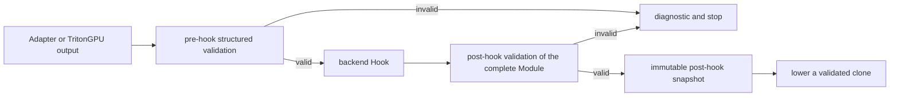

# AnchorIR Structured Validation and Golden Regression (T6.5, Triton 3.3)

This document describes the T6.5 implementation and acceptance boundary for
the Triton 3.3 checkout. The normative dialect and diagnostic contract is
loaded from the versioned JSON under `python/triton_anchor/spec/`; this file
documents how that contract is enforced and tested.

## Scope and 3.3-specific contract

T6.5 replaces shallow text/top-level-operation checks with bounded, structured
validation of real MLIR `Operation`, `Region`, `Block`, `Type`, and `Attribute`
objects. It also provides a fail-closed Adapter/Hook lifecycle, stable
normalization and SHA-256, and ordered Golden comparison.

This branch targets Triton **3.3.0** and uses the 3.3 TritonGPU namespace
`ttg` (for example `ttg.num-warps`, `ttg.threads-per-warp`, and
`ttg.num-ctas`). Its default contract is `anchor-ir/2.0.0`, defined in
`spec/anchor-ir-2.0.0.json`. The 1.0.0 and 1.1.0 files are retained for
audit and contract-evolution review, but this 3.3 build deliberately executes
only 2.0.0; callers of an older version receive `AIR-REQUEST-002` rather than
silently mixing contracts. The 2.0.0 policy keeps a 15-dialect Linalg
core, a 9-dialect TritonGPU core (`ttg` replaces the older `triton_gpu` name),
and explicit forbidden namespaces.

The 3.3 binding entry point is `csrc/bindings/triton_anchor_ext.cc`. Its
`load_dialects()` registers the standard MLIR dialects required by both Tracks
and the Func inliner extension, then registers Triton/TritonGPU and the
triton-shared dialects. This registration is required for the real 3.3
Linalg Adapter; it is a version adapter, not a change to the Track whitelist.

## Implementation map

| Layer | Files | Responsibility |
|---|---|---|
| Versioned policy | `python/triton_anchor/spec/anchor-ir-*.json` | Allowed/forbidden namespaces, semantic invariants, diagnostic templates. |
| Policy loader | `python/triton_anchor/anchor_ir_rules.py` | Validates version, Track, Phase, and extension declarations; JSON is the sole rule source. |
| Report model | `python/triton_anchor/anchor_ir_schema.py` | Stable error code, message, Track/Phase, object kind/name, operation/object paths, location, and hint. |
| Native validator | `csrc/lib/Validation/AnchorIRValidator.cpp`, `csrc/include/triton-anchor/Validation/AnchorIRValidator.h` | Bounded recursive traversal, Type/Attribute checks, 3.3 `ttg` semantics, parser/verifier safety preflight, normalization. |
| Python binding | `csrc/bindings/triton_anchor_validator.cc`, `csrc/bindings/AnchorIRValidatorBindings.h` | Exposes the native report and normalization API. |
| 3.3 dialect setup | `csrc/bindings/triton_anchor_ext.cc`, `CMakeLists.txt` | Registers standard dialects, inliner extension, Triton dialects, and links validation components. |
| Structured API | `python/triton_anchor/anchor_ir_validator.py` | Converts native output to `AnchorIRValidationReport`. |
| Lifecycle | `python/triton_anchor/anchor_ir_lifecycle.py`, `pipeline.py`, `adapters/base.py` | Enforces Adapter output → pre-hook → Hook → post-hook → lowering. |
| 3.3 Adapter | `python/triton_anchor/adapters/triton_linalg_adapter.py` | Runs the in-tree 3.3 Triton-to-Linalg pass pipeline and supplies the owning context. |
| Normalization/Golden | `anchor_ir_normalizer.py`, `anchor_ir_golden.py` | Canonical text, stable hash, manifest validation, first-divergence report. |
| Text isolation | `_anchor_ir_text_isolation.py`, `_anchor_ir_text_worker.py` | Contains parser crashes, enforces input/worker budgets and fail-closed timeout reports. |
| CLI | `anchor_ir_cli.py`, `setup.py` | `triton-anchor-validate`, text/JSON output, stable exit codes and package data. |
| Tests and corpus | `python/triton_anchor/tests/` and `tests/data/anchor_ir/` | Positive/negative Track cases, lifecycle, CLI/API, packaging, resource and Golden regressions. |
| Acceptance scripts | `scripts/verify_t65.py`, `scripts/verify_t65_all.py` | Reproducible current-worktree gate and machine-readable summary. |

## Structured validation

The C++ core first applies bounded structural and semantic checks, then calls
the MLIR verifier only when its known unsafe preconditions have been excluded.
It recursively visits nested Regions/Blocks and all operand, result, block
argument, signature, operation-attribute, module-attribute, container,
encoding, tensor and memref components. Unknown and explicitly forbidden
dialects have distinct diagnostics. Shared Type/Attribute DAGs use a logical
visit budget so path-specific diagnostics are not lost.

The 3.3 semantic layer understands `ttg` encodings, warp/CTA/thread topology,
rank relationships, `tt.dot` contracts, `tt.reshape` cardinality and layout
interfaces, and 3.3 memory-descriptor forms. Text preflight masks only `//`
comment bytes while preserving source offsets, so legal comments cannot cause
false rejection and cannot hide an unsafe custom attribute. Native parsing is
performed in an isolated worker for untrusted text; explicit contexts remain
available for callers that have already registered an out-of-tree dialect.

The legacy `AnchorIRValidator` in `anchor_ir.py` (`validate()`, `is_valid()`,
`validate_and_raise()`, and `validate_pre_hook()/validate_post_hook()`) is only
a legacy regex compatibility scanner. It does not parse MLIR or validate
nested Regions, Types, Attributes, Properties, verifier rules, or Track
semantics, so it is not a production AnchorIR gate. New integrations must use
`StructuredAnchorIRValidator` or the lifecycle entry point.

## Lifecycle boundary



Pre-hook accepts only the selected Track core policy. A failure prevents Hook
and lowering. Post-hook revalidates the entire Module, not only newly created
operations. A backend may declare only non-core extension namespaces; core
Forbidden namespaces (`smt`, `tts`, `tptr`, and the Track-specific Triton
namespaces) cannot be reopened. `adapter.compile()` and
`run_anchor_ir_compilation()` are the public Linalg entry points; a TritonGPU
backend can call `AnchorIRLifecycleOrchestrator.run_module_or_raise()`.

The repository's generic `triton.compiler.compile()` only runs registered
backend stages. It cannot automatically force this lifecycle on every
out-of-tree backend. External backends must call one of the fail-closed
interfaces in their stage, as shown in `docs/custom_backend.md`.

## Python API and CLI

```python
from triton_anchor import (
    ANCHOR_IR_SPEC_VERSION, AnchorIRPhase, AnchorIRTrack,
    StructuredAnchorIRValidator,
)

report = StructuredAnchorIRValidator().validate_text(
    mlir_text,
    spec_version=ANCHOR_IR_SPEC_VERSION,
    track=AnchorIRTrack.LINALG,
    phase=AnchorIRPhase.PRE_HOOK,
    source_name="input.mlir",
)
```

```bash
triton-anchor-validate input.mlir \
  --spec-version anchor-ir/2.0.0 \
  --track linalg --phase pre_hook --format json
```

Python and CLI serialize the same `AnchorIRValidationReport`. Exit code `0`
means valid, `1` means a contract/parse/verifier failure, and `2` means CLI
usage or infrastructure error. The wheel must carry the selected spec files,
corpus/Golden data, and public validator header; the package version and
`setup.py` metadata are required to match (`0.2.0` in this branch).

## Normalization and Golden semantics

Phase (`pre_hook`/`post_hook`) selects validation policy; Golden Stage is an
ordered observation point. Valid Stage IDs are `adapter.output`,
`pass.<stable-name>.after`, `hook.<stable-name>.after`, and
`boundary.post_hook`. A manifest starts at Adapter output and ends at the
post-hook boundary. Comparison stops at the first mismatch and reports the
Stage, old/new SHA-256, and normalized IR diff.

Normalization fixes UTF-8, LF, one trailing newline, stable SSA/Block naming,
and exclusion of non-semantic locations while retaining layout, encoding,
parallelism, and resource semantics. Invalid IR never produces an acceptable
Golden. Manifest input is bounded by JSON size/nesting, Stage count, and total
normalized-payload bytes. Default isolated verification reuses identical
phase/extension/payload checks and shares a 60-second manifest deadline.
Explicit `context=` parsing is trusted in-process and therefore does not claim
the isolated wall-clock guarantee.

## One-click acceptance

Build the current 3.3 native artifact first, then run from the worktree root:

```bash
./scripts/verify_t65_all.py \
  --summary-json build/t65-summary.json
```

The runner validates staged/worktree whitespace, the exact Triton version read
from this checkout's `triton/python/triton/__init__.py`,
the canonical `build/lib.*/triton/_C/libtriton.so`, current source
`python/triton_anchor`, the converter capability, AnchorIR tests, smoke tests,
API/CLI equivalence, and `verify_t65.py`. It uses an isolated temporary
launcher and source overlay so an editable install or stale `build/lib` copy
cannot make the result falsely green. It does not build Triton, install
dependencies, or create a wheel.

For release evidence, additionally build a fresh wheel and install it into a
new virtual environment with `PYTHONPATH` and user-site packages removed.
Check CLI valid/invalid exits, package assets, and the four exported native
symbols with `nm -D -C --defined-only`.

## Explicit boundaries

The T6.5 PR owns the AnchorIR validator, lifecycle component, normalization,
manifest semantics, tests, corpus samples, packaging assets, scripts, and this
3.3 implementation/acceptance document. It does not own Triton/LLVM builds,
FTVM or vendor lowering, device correctness, CI orchestration, T10.3's generic
corpus runner/cache-miss collection, or automatic injection into arbitrary
external backends. Repository tests that require an enterprise backend, Torch,
or a physical device remain separate external gates.
